# Securing Microsoft Copilot with Reco

> Microsoft Copilot enforces existing Microsoft 365 permissions. If a user can open a file, Copilot can surface it in an answer. That means any oversharing already present across SharePoint, OneDrive, Teams, or email becomes immediately discoverable the moment Copilot is enabled.

This guide covers what to fix before rollout, the security controls that reduce exposure, and the monitoring needed to spot misuse after Copilot goes live. Based on the enterprise security guide by [Reco](https://www.reco.ai/) (January 2026).

---

## Why This Matters

Copilot doesn't create new access paths. It makes existing ones queryable through natural language. A file that was technically accessible but buried three folders deep in SharePoint is now one prompt away from being surfaced, summarized, and shared.

The real risk isn't Copilot — it's the permission debt underneath it.

## The 5-Step Framework

Fix permissions first. Enable Copilot second. Monitor continuously after.

| Step | Focus | When | Gate |
|------|-------|------|------|
| [1. Fix Permission Debt](docs/step-1-fix-permission-debt.md) | Audit & remediate overshared content | Pre-rollout | Zero critical overshared files |
| [2. Pass Posture Checks](docs/step-2-posture-checks.md) | Validate 6 security configurations | Pre-rollout | All HIGH severity checks pass |
| [3. Block High-Risk Users](docs/step-3-block-high-risk-users.md) | Conditional Access policy enforcement | Pre-rollout | CA policy enforced in Entra ID |
| [4. Detect Risky AI Usage](docs/step-4-detect-risky-ai-usage.md) | Monitor Copilot-driven data access | Post-rollout | Baseline established |
| [5. Monitor Scope Drift](docs/step-5-monitor-scope-drift.md) | Track plugin & permission expansion | Ongoing | No unreviewed scope violations |

---

## Step 1: The SharePoint Inheritance Trap

Before Copilot, a folder marked "Finance Team Only" felt safe. But SharePoint permission inheritance breaks at the file level. Individual files inside that folder may have been shared org-wide or externally years ago. Copilot queries based on effective access — it will find those files.

```mermaid
graph TD
    ROOT["/sites/finance/Shared Documents"<br/><b>Restricted: Finance Team Only</b>] --> F1
    ROOT --> F2

    F1["📁 Q4 Reports/<br/><i>Inherits: Finance Team</i>"]
    F2["📁 Budgets/<br/><i>Inherits: Finance Team</i>"]

    F1 --> D1["📄 revenue.xlsx<br/>✅ Finance Team only"]
    F1 --> D2["📄 projections.pptx<br/>⚠️ Shared: Everyone"]
    F2 --> D3["📄 2026-budget.xlsx<br/>🔴 Anonymous Link"]

    CP[🤖 Copilot:<br/><i>'Show me the 2026 budget'</i>]
    CP -.->|Everyone access| D2
    CP -.->|Anonymous link| D3

    style D2 fill:#ffd93d,color:#000
    style D3 fill:#ff6b6b,color:#fff
    style CP fill:#0078d4,color:#fff
    style ROOT fill:#636e72,color:#fff
```



**Action:** Generate a report of files where sensitivity labels conflict with their sharing scope. Remediate before Copilot is enabled.

### Sensitivity Label vs. Sharing Scope — Risk Matrix

```
                    │  Named Users  │  Team/Group  │  Org-Wide  │  External  │  Anonymous
────────────────────┼───────────────┼──────────────┼────────────┼────────────┼───────────
Highly Confidential │   ✅ LOW      │  ⚠️ MEDIUM   │  🔴 CRIT   │  🔴 CRIT   │  🔴 CRIT
Confidential        │   ✅ LOW      │  ✅ LOW      │  🟠 HIGH   │  🔴 CRIT   │  🔴 CRIT
Internal Only       │   ✅ LOW      │  ✅ LOW      │  ✅ LOW    │  🟠 HIGH   │  🔴 CRIT
General             │   ✅ LOW      │  ✅ LOW      │  ✅ LOW    │  ⚠️ MEDIUM  │  🟠 HIGH
```

→ [Full Step 1 Guide](docs/step-1-fix-permission-debt.md)

---

## Step 2: Six Posture Checks

These validate the configurations that most directly shape Copilot exposure. Each check maps to CIS Microsoft 365 Benchmark v5.0 and ISO 27001:2022 controls. If any HIGH check fails, do not enable Copilot.

| Check | Severity | CIS M365 v5.0 | ISO 27001:2022 |
|-------|----------|----------------|----------------|
| Conditional Access (MFA + device + location) | **HIGH** | 5.2.2, 5.2.3 | A.8.3, A.8.5 |
| DLP policies cover Copilot interactions | **HIGH** | 3.1.1, 3.2.1 | A.8.10, A.8.12 |
| Sensitivity labels deployed + auto-labeling | **HIGH** | 3.3.1 | A.5.12, A.5.13 |
| External sharing scoped to approved domains | MEDIUM | 7.2.3, 7.2.6 | A.5.14, A.8.3 |
| Device compliance enforced via Intune | MEDIUM | 5.1.2 | A.8.1 |
| Audit logging captures Copilot events | MEDIUM | 8.5.1 | A.8.15 |

**Gate:** All HIGH checks pass → pilot. All MEDIUM checks pass → production rollout.

→ [Full Step 2 Guide](docs/step-2-posture-checks.md)

---

## Step 3: Block High-Risk Users via Conditional Access

Users with elevated risk — departing employees, compromised accounts, over-privileged admins, unmanaged external identities — should not have Copilot access. Risk labels update dynamically based on Entra ID Protection signals and HR lifecycle events.

**Action:** Create a Conditional Access policy that blocks Microsoft 365 Copilot for users in a dynamic high-risk security group. See the [ready-to-import policy template](scripts/conditional_access_policy.json).

→ [Full Step 3 Guide](docs/step-3-block-high-risk-users.md)

---

## Step 4: Detect Risky Usage After Go-Live

Start detection policies in **Preview mode** during pilot (alerts generated, no production routing). Once you understand normal patterns, switch to **Production mode** with full SOC/SIEM routing.

What to detect: bulk file access via Copilot, sensitive content surfacing, anomalous usage patterns, cross-tenant boundary probes, exfiltration signals, departing employee activity.

See [`policies/detection-policies.yaml`](policies/detection-policies.yaml) for the full policy set.

→ [Full Step 4 Guide](docs/step-4-detect-risky-ai-usage.md)

---

## Step 5: Monitor Scope Drift

Copilot's effective access expands silently as plugins are added and permission scopes change. What starts as `Files.Read` + `User.Read` can drift to `Mail.ReadWrite` + `Sites.ReadWrite.All` within months.

### OAuth Scope Risk Tiers

```
🔴 CRITICAL                          🟠 HIGH
├─ Directory.ReadWrite.All           ├─ Files.ReadWrite.All
├─ Mail.ReadWrite                    ├─ Sites.ReadWrite.All
├─ Mail.Send                         ├─ Chat.ReadWrite.All
└─ RoleManagement.ReadWrite.Dir      └─ ChannelMessage.Read.All

🟡 MEDIUM                            🟢 LOW
├─ User.Read.All                     ├─ User.Read
├─ Group.Read.All                    ├─ profile
├─ Directory.Read.All                ├─ openid
└─ Sites.Read.All                    └─ offline_access
```

→ [Full Step 5 Guide](docs/step-5-monitor-scope-drift.md)

---

## How It All Connects

This is the end-to-end flow from user request to monitored response:


---

## Also Worth Knowing

Microsoft has been rolling out native Copilot controls that complement this approach:

- **Restricted SharePoint Search** — Limits which sites Copilot can index. Useful as a safety net during rollout before permission debt is fully remediated.
- **SharePoint Advanced Management** — Native oversharing reports and site-level access governance.
- **Data Access Governance Reports** — Identifies broadly shared content across the tenant.

These reduce *what* Copilot can access. The framework above monitors *how* that access is being used.

---

## Repository Structure

```
docs/
├── step-1-fix-permission-debt.md       # Permission audit & remediation
├── step-2-posture-checks.md            # 6 posture checks + compliance mapping
├── step-3-block-high-risk-users.md     # Identity risk & Conditional Access
├── step-4-detect-risky-ai-usage.md     # Detection policies & alert triage
└── step-5-monitor-scope-drift.md       # Plugin scope monitoring

scripts/
├── permission_audit.py                 # Risk classification framework for M365 permissions
├── posture_check_validator.py          # Posture check reference implementation
├── scope_drift_monitor.py              # Scope risk mapping for Graph API permissions
└── conditional_access_policy.json      # CA policy template for Entra ID import

policies/
├── detection-policies.yaml             # Conceptual detection policy definitions
└── governance-checklist.yaml           # Governance cadence checklist

diagrams/
├── permission-flow.mmd                 # End-to-end permission evaluation sequence
└── identity-risk-decision-tree.mmd     # User risk classification decision tree
```

> **Note on scripts:** The Python scripts provide reusable data models, risk classification logic, and scope mapping — not turnkey automation. They're structured to be extended with Microsoft Graph API calls for your environment. See each script's docstring for integration guidance.

## License

MIT — see [LICENSE](LICENSE)
