# Securing Microsoft Copilot with Reco

**A hands-on enterprise security framework for Microsoft 365 Copilot deployments**

> Microsoft Copilot enforces existing Microsoft 365 permissions. If a user can open a file, Copilot can surface it in an answer. Any oversharing already present across SharePoint, OneDrive, Teams, or email becomes immediately discoverable the moment Copilot is enabled.

*By Reco Security Experts — January 2026*

---

## The Fundamental Problem

Copilot doesn't create new permissions — it **weaponizes existing ones**. Every legacy share, every orphaned link, every over-permissioned folder becomes instantly queryable through natural language.


## Attack Surface Amplification


---

## The 5-Step Security Framework


| Step | Focus | When | Key Action |
|------|-------|------|------------|
| [Step 1](docs/step-1-fix-permission-debt.md) | Permission Debt | Pre-rollout | Audit & remediate overshared sensitive content |
| [Step 2](docs/step-2-posture-checks.md) | Posture Checks | Pre-rollout | Validate 6 security configurations |
| [Step 3](docs/step-3-block-high-risk-users.md) | High-Risk Users | Pre-rollout | Conditional Access blocking |
| [Step 4](docs/step-4-detect-risky-ai-usage.md) | Threat Detection | Post-rollout | Monitor Copilot-driven data access |
| [Step 5](docs/step-5-monitor-scope-drift.md) | Scope Drift | Ongoing | Track plugin & permission expansion |

---

## Step 1: Fix Permission Debt First

Before enabling Copilot, you need a clear picture of what your current permissions expose. Legacy sharing and unmanaged access sprawl create risk that is invisible until Copilot makes it searchable.

### The SharePoint Inheritance Trap

```mermaid
graph TD
    ROOT["/sites/finance/Shared Documents"<br/><b>Restricted: Finance Team Only</b>] --> F1
    ROOT --> F2
    ROOT --> F3

    F1["📁 Q4 Reports/<br/><i>Inherits: Finance Team</i>"]
    F2["📁 Budgets/<br/><i>Inherits: Finance Team</i>"]
    F3["📁 Board Deck/<br/><i>Inherits: Finance Team</i>"]

    F1 --> D1["📄 revenue.xlsx<br/>✅ Finance Team only"]
    F1 --> D2["📄 projections.pptx<br/>⚠️ Shared: Everyone"]
    F2 --> D3["📄 2026-budget.xlsx<br/>🔴 Shared: Anonymous Link"]
    F2 --> D4["📄 headcount.xlsx<br/>✅ Finance Team only"]
    F3 --> D5["📄 strategy.pptx<br/>🔴 Shared: External Partner"]

    CP[🤖 Copilot Query:<br/><i>'Show me the 2026 budget<br/>and revenue projections'</i>]
    CP -.->|User has<br/>Everyone access| D2
    CP -.->|Anonymous link<br/>= all users| D3
    CP -.->|If user is the<br/>external partner| D5

    style D2 fill:#ffd93d,color:#000
    style D3 fill:#ff6b6b,color:#fff
    style D5 fill:#ff6b6b,color:#fff
    style CP fill:#0078d4,color:#fff
    style ROOT fill:#636e72,color:#fff
```



### Sensitivity Label Conflict Matrix

Files where sensitivity labels conflict with their sharing scope must be remediated before Copilot is enabled:

```
RISK MATRIX: Sensitivity Label vs. Sharing Scope

                    │  Named Users  │  Team/Group  │  Org-Wide  │  External  │  Anonymous
────────────────────┼───────────────┼──────────────┼────────────┼────────────┼───────────
Highly Confidential │   ✅ LOW      │  ⚠️ MEDIUM   │  🔴 CRIT   │  🔴 CRIT   │  🔴 CRIT
Confidential        │   ✅ LOW      │  ✅ LOW      │  🟠 HIGH   │  🔴 CRIT   │  🔴 CRIT
Internal Only       │   ✅ LOW      │  ✅ LOW      │  ✅ LOW    │  🟠 HIGH   │  🔴 CRIT
General             │   ✅ LOW      │  ✅ LOW      │  ✅ LOW    │  ⚠️ MEDIUM  │  🟠 HIGH
Public              │   ✅ LOW      │  ✅ LOW      │  ✅ LOW    │  ✅ LOW    │  ✅ LOW
```

→ [Full Step 1 Guide](docs/step-1-fix-permission-debt.md)

---

## Step 2: Pass the Copilot Posture Checks

Six posture checks validate the configurations that most directly shape Copilot exposure. Navigate to **AI Governance → AI Posture Checks** in Reco.

```mermaid
graph TD
    subgraph "HIGH Severity — Must pass before any Copilot access"
        CA[🔐 Conditional Access<br/><i>MFA + Device + Location</i>]
        DLP[🛡️ Data Loss Prevention<br/><i>Covers Copilot interactions</i>]
        SL[🏷️ Sensitivity Labels<br/><i>Deployed & auto-labeling active</i>]
    end

    subgraph "MEDIUM Severity — Must pass before broad rollout"
        ES[🌐 External Sharing<br/><i>Scoped to approved domains</i>]
        DC[💻 Device Compliance<br/><i>MDM enforced</i>]
        AL[📋 Audit Logging<br/><i>Copilot events captured</i>]
    end

    CA & DLP & SL --> GATE1{🚧 Gate 1<br/>All HIGH pass?}
    GATE1 -->|Yes| PILOT[✅ Pilot Deployment]
    GATE1 -->|No| BLOCK1[🚫 Do Not Enable Copilot]

    ES & DC & AL --> GATE2{🚧 Gate 2<br/>All MEDIUM pass?}
    GATE2 -->|Yes| PROD[✅ Production Rollout]
    GATE2 -->|No| LIMIT[⚠️ Limited to Pilot Only]

    PILOT --> GATE2

    style CA fill:#ff6b6b,color:#fff
    style DLP fill:#ff6b6b,color:#fff
    style SL fill:#ff6b6b,color:#fff
    style ES fill:#ff9f43,color:#fff
    style DC fill:#ff9f43,color:#fff
    style AL fill:#ff9f43,color:#fff
    style GATE1 fill:#2d3436,color:#fff
    style GATE2 fill:#2d3436,color:#fff
    style BLOCK1 fill:#d63031,color:#fff
    style PILOT fill:#00b894,color:#fff
    style PROD fill:#00b894,color:#fff
```



### Compliance Mappings

| Posture Check | CIS M365 Benchmark v5.0 | ISO 27001:2022 |
|--------------|--------------------------|----------------|
| Conditional Access | 5.2.2, 5.2.3 | A.8.3, A.8.5 |
| DLP Policies | 3.1.1, 3.2.1 | A.8.10, A.8.12 |
| Sensitivity Labels | 3.3.1 | A.5.12, A.5.13 |
| External Sharing | 7.2.3, 7.2.6 | A.5.14, A.8.3 |
| Device Compliance | 5.1.2 | A.8.1 |
| Audit Logging | 8.5.1 | A.8.15 |

→ [Full Step 2 Guide](docs/step-2-posture-checks.md)

---

## Step 3: Block High-Risk Users

Not every identity in your tenant should have access to Copilot. Navigate to **Identities → Users** in Reco.

```mermaid
graph TD
    subgraph "Identity Risk Signals"
        HR[HR Lifecycle<br/><i>Departure workflow</i>]
        EN[Entra ID Protection<br/><i>Risk score: High</i>]
        BH[Behavioral Analytics<br/><i>Anomalous patterns</i>]
        OP[Over-Privileged<br/><i>Excessive access</i>]
    end

    HR & EN & BH & OP --> DG[Dynamic Security Group<br/><b>high-risk-copilot-block</b>]

    DG --> CAP[Conditional Access Policy<br/><i>Block Microsoft 365 Copilot</i>]

    CAP --> |Enforced| R1[🚫 Copilot Blocked]
    CAP --> |Audit mode| R2[📋 Logged for Review]

    subgraph "User Categories Blocked"
        U1[👤 Departing Employees]
        U2[👤 Compromised Accounts]
        U3[👤 External Identities]
        U4[👤 Over-Privileged Admins]
    end

    DG --> U1 & U2 & U3 & U4

    style DG fill:#e17055,color:#fff
    style CAP fill:#0078d4,color:#fff
    style R1 fill:#d63031,color:#fff
    style HR fill:#fdcb6e,color:#000
    style EN fill:#fdcb6e,color:#000
    style BH fill:#fdcb6e,color:#000
    style OP fill:#fdcb6e,color:#000
```



Risk labels update dynamically based on identity risk signals and HR-driven lifecycle events. If a user is flagged as elevated risk or in a departure workflow, they should not retain Copilot access by default.

→ [Full Step 3 Guide](docs/step-3-block-high-risk-users.md)

---

## Step 4: Detect Risky AI Usage

Once Copilot is live, you need continuous visibility. Navigate to **Threat Detection → Policy Center** in Reco.

```mermaid
graph TD
    subgraph "Detection Policies"
        P1[🔴 Bulk Data Access<br/><i>50+ files in 1 hour</i>]
        P2[🔴 Sensitive Content Surfacing<br/><i>Confidential label in response</i>]
        P3[🟠 Anomalous Usage Pattern<br/><i>Off-hours + high volume</i>]
        P4[🔴 Cross-Boundary Access<br/><i>Guest user + cross-tenant</i>]
        P5[🔴 Data Exfiltration Signals<br/><i>Copy + external share</i>]
        P6[🟠 Departing Employee Usage<br/><i>Lifecycle status: departing</i>]
    end

    subgraph "Deployment Phases"
        PREV[👁️ Preview Mode<br/><i>Pilot — generates alerts,<br/>no production routing</i>]
        PROD[🔔 Production Mode<br/><i>Full alert routing<br/>to SOC/SIEM</i>]
    end

    P1 & P2 & P3 & P4 & P5 & P6 --> PREV
    PREV -->|Baseline<br/>established| PROD

    PROD --> SIEM[SIEM Integration<br/><i>Sentinel / Splunk / Chronicle</i>]
    PROD --> SOAR[SOAR Automation<br/><i>Auto-response workflows</i>]
    PROD --> SOC[SOC Dashboard<br/><i>Alert triage queue</i>]

    style PREV fill:#74b9ff,color:#000
    style PROD fill:#0984e3,color:#fff
    style SIEM fill:#6c5ce7,color:#fff
    style SOAR fill:#6c5ce7,color:#fff
    style SOC fill:#6c5ce7,color:#fff
```



### Alert Severity & SLA

```
┌──────────┬────────────────────────────────────┬──────────────────┐
│ Severity │ Trigger Example                    │ Response SLA     │
├──────────┼────────────────────────────────────┼──────────────────┤
│ CRITICAL │ Cross-tenant data discovery         │ 15 minutes       │
│ CRITICAL │ Data exfiltration pattern           │ 15 minutes       │
│ HIGH     │ Bulk file access via Copilot        │ 4 hours          │
│ HIGH     │ Sensitive content surfacing         │ 4 hours          │
│ MEDIUM   │ Anomalous usage pattern             │ 24 hours         │
│ MEDIUM   │ Departing employee Copilot usage    │ 24 hours         │
│ LOW      │ Minor policy deviation              │ Weekly review    │
└──────────┴────────────────────────────────────┴──────────────────┘
```

→ [Full Step 4 Guide](docs/step-4-detect-risky-ai-usage.md)

---

## Step 5: Monitor Permission Scope Drift

Over time, Copilot's effective access can expand as plugins are connected and permission scopes change. Navigate to **AI Governance → Connected AI Apps** in Reco.


### OAuth Scope Risk Classification

```
SCOPE RISK HEATMAP

🔴 CRITICAL                          🟠 HIGH
├─ Directory.ReadWrite.All           ├─ Files.ReadWrite.All
├─ Mail.ReadWrite                    ├─ Sites.ReadWrite.All
├─ Mail.Send                         ├─ Chat.ReadWrite.All
└─ RoleManagement.ReadWrite.Dir      └─ ChannelMessage.Read.All

🟡 MEDIUM                            🟢 LOW
├─ User.Read.All                     ├─ User.Read
├─ Group.Read.All                    ├─ profile
├─ Directory.Read.All                ├─ openid
└─ Sites.Read.All                    └─ offline_access
```

→ [Full Step 5 Guide](docs/step-5-monitor-scope-drift.md)

---

## Ongoing Governance


→ [Full Governance Guide](docs/ongoing-governance.md)

---

## End-to-End Security Control Flow

```mermaid
sequenceDiagram
    participant U as End User
    participant CA as Conditional Access
    participant CP as Microsoft Copilot
    participant M365 as M365 Permission Engine
    participant DLP as DLP Policy Engine
    participant R as Reco Platform

    U->>CA: Request Copilot access
    CA->>CA: Check user risk level
    CA->>CA: Check device compliance
    CA->>CA: Check location policy

    alt User is high-risk or non-compliant
        CA-->>U: 🚫 Access Blocked
        CA->>R: Log blocked attempt
    else User passes CA checks
        CA->>CP: Access granted
        U->>CP: Natural language query
        CP->>M365: Evaluate user's effective permissions
        M365-->>CP: Accessible files & data
        CP->>DLP: Check response content
        alt DLP violation detected
            DLP-->>CP: 🚫 Block sensitive content
            DLP->>R: Alert: sensitive surfacing
        else No DLP violation
            CP-->>U: Copilot response delivered
        end
        CP->>R: Log interaction metadata
        R->>R: Evaluate detection policies
        alt Anomaly detected
            R-->>R: Generate alert
            R->>R: Route to SOC per SLA
        end
    end
```



---

## Repository Structure

```
secure-microsoft-copilot-with-reco/
│
├── README.md                                    # Full guide with 12+ Mermaid diagrams
├── LICENSE
│
├── docs/
│   ├── step-1-fix-permission-debt.md            # Permission audit & remediation
│   ├── step-2-posture-checks.md                 # 6 posture checks with compliance mapping
│   ├── step-3-block-high-risk-users.md          # Identity risk & Conditional Access
│   ├── step-4-detect-risky-ai-usage.md          # Detection policies & alert triage
│   ├── step-5-monitor-scope-drift.md            # Plugin scope monitoring
│   ├── ongoing-governance.md                    # Cadence & metrics
│   └── native-purview-controls.md               # Complementary Microsoft native controls
│
├── scripts/
│   ├── permission_audit.py                      # Audit M365 permissions for Copilot readiness
│   ├── posture_check_validator.py               # Validate all 6 posture checks
│   ├── scope_drift_monitor.py                   # Monitor connected app scope changes
│   └── conditional_access_policy.json           # Ready-to-import CA policy template
│
├── policies/
│   ├── copilot-conditional-access.json          # 3 CA policy templates
│   ├── detection-policies.yaml                  # 6 detection policies with alert routing
│   └── governance-checklist.yaml                # Full governance cadence & metrics
│
└── diagrams/
    ├── copilot-security-architecture.mmd        # Full architecture (Mermaid source)
    ├── threat-model.mmd                         # Copilot threat model
    ├── permission-flow.mmd                      # Permission evaluation flow
    ├── deployment-phases.mmd                    # Phased rollout diagram
    └── identity-risk-decision-tree.mmd          # User risk classification logic
```

## Quick Start

```bash
# 1. Review your permission exposure
python scripts/permission_audit.py --tenant-id YOUR_TENANT_ID --output report.json

# 2. Validate posture checks
python scripts/posture_check_validator.py --output posture.json

# 3. Monitor scope drift
python scripts/scope_drift_monitor.py --output drift.json
```

## Complementary: Native Microsoft Purview Copilot Controls

This guide focuses on securing Copilot through Reco's AI governance layer. Microsoft has also been rolling out native controls within Purview that work alongside third-party solutions:


| Native Control | What It Does | Complements |
|---------------|-------------|-------------|
| **Restricted SharePoint Search** | Limits which SharePoint sites Copilot can index and surface content from. Acts as allowlist for Copilot data access. | Step 1 — reduces the blast radius of permission debt by restricting Copilot's searchable scope |
| **SharePoint Advanced Management** | Provides oversharing reports, site lifecycle policies, and access governance at the site collection level. | Step 1 — native tooling for identifying and remediating permission sprawl |
| **Data Access Governance Reports** | Identifies content shared broadly (org-wide, external, anonymous) across the tenant. | Step 1 — Microsoft-native equivalent of the permission audit |
| **Topic-Level Permission Controls** | Restricts Copilot from surfacing content in specific topics or sensitivity categories. | Step 2 — extends sensitivity label enforcement into Copilot's response generation |

> **How they work together:** Native Purview controls reduce the attack surface by limiting *what* Copilot can access. Reco adds the detection, identity risk analysis, and continuous monitoring layer to catch *how* that access is being used — and to flag misuse that native controls alone won't detect.

---

## Key Takeaway

> Microsoft Copilot does not create new permissions, but it changes how existing access is discovered and used. If you enable it before cleaning up permission sprawl and risky identities, Copilot can turn quiet oversharing into fast, searchable exposure.

## Compliance Alignment

- **CIS Microsoft 365 Foundations Benchmark v5.0**
- **ISO 27001:2022**

## Credits

Based on the enterprise security guide by **Reco Security Experts** (January 2026).

## License

MIT — see [LICENSE](LICENSE)
