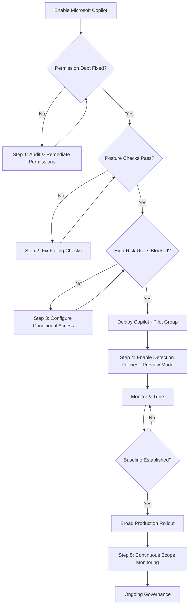

# Copilot Security Architecture Diagrams

## Threat Model

```
                    ┌─────────────────────┐
                    │      End User       │
                    └──────────┬──────────┘
                               │
                    ┌──────────▼──────────┐
                    │  Microsoft Copilot  │
                    │    (AI Interface)   │
                    └──────────┬──────────┘
                               │
              ┌────────────────┼────────────────┐
              │                │                │
    ┌─────────▼──────┐ ┌──────▼───────┐ ┌──────▼──────┐
    │  SharePoint    │ │   OneDrive   │ │   Teams     │
    │  Sites & Docs  │ │    Files     │ │  Messages   │
    └─────────┬──────┘ └──────┬───────┘ └──────┬──────┘
              │                │                │
              └────────────────┼────────────────┘
                               │
                    ┌──────────▼──────────┐
                    │   M365 Permission   │
                    │      Engine         │
                    │                     │
                    │  ⚠️ Copilot uses    │
                    │  existing access    │
                    │  — no new perms     │
                    └─────────────────────┘
```

## Security Control Flow

```
User Request to Copilot
         │
         ▼
┌─────────────────┐     ┌──────────────────────┐
│ Conditional     │────▶│ Block if:            │
│ Access Check    │     │ • High-risk user     │
│                 │     │ • Non-compliant dev  │
│                 │     │ • Restricted location│
└────────┬────────┘     └──────────────────────┘
         │ ✅ Pass
         ▼
┌─────────────────┐     ┌──────────────────────┐
│ Permission      │────▶│ Filter results by:   │
│ Evaluation      │     │ • User effective     │
│                 │     │   permissions        │
│                 │     │ • Sensitivity labels │
└────────┬────────┘     └──────────────────────┘
         │
         ▼
┌─────────────────┐     ┌──────────────────────┐
│ DLP Policy      │────▶│ Check response for:  │
│ Check           │     │ • Sensitive data     │
│                 │     │ • PII / PHI          │
│                 │     │ • Financial data     │
└────────┬────────┘     └──────────────────────┘
         │ ✅ Pass
         ▼
┌─────────────────┐
│ Copilot         │
│ Response        │
│ Delivered       │
└────────┬────────┘
         │
         ▼
┌─────────────────┐     ┌──────────────────────┐
│ Reco Monitoring │────▶│ Detect:              │
│ (Continuous)    │     │ • Bulk access        │
│                 │     │ • Anomalous patterns │
│                 │     │ • Sensitive surfacing│
│                 │     │ • Scope drift        │
└─────────────────┘     └──────────────────────┘
```

## Deployment Phases

```
Phase 1: Pre-Rollout          Phase 2: Pilot              Phase 3: Production
─────────────────────         ──────────────────          ────────────────────

┌───────────────────┐         ┌────────────────┐         ┌──────────────────┐
│ Fix Permission    │         │ Enable for     │         │ Broad rollout    │
│ Debt (Step 1)     │         │ pilot group    │         │                  │
├───────────────────┤         ├────────────────┤         ├──────────────────┤
│ Pass Posture      │         │ Detection in   │         │ Detection in     │
│ Checks (Step 2)   │────────▶│ Preview mode   │────────▶│ Production mode  │
├───────────────────┤         ├────────────────┤         ├──────────────────┤
│ Block High-Risk   │         │ Monitor and    │         │ Ongoing          │
│ Users (Step 3)    │         │ tune policies  │         │ governance       │
└───────────────────┘         └────────────────┘         └──────────────────┘

Gate: All HIGH checks pass    Gate: Baseline established   Gate: All MEDIUM pass
```

## Mermaid Diagram (for Code Wiki rendering)


