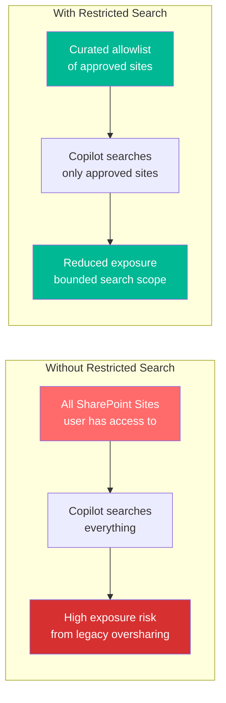
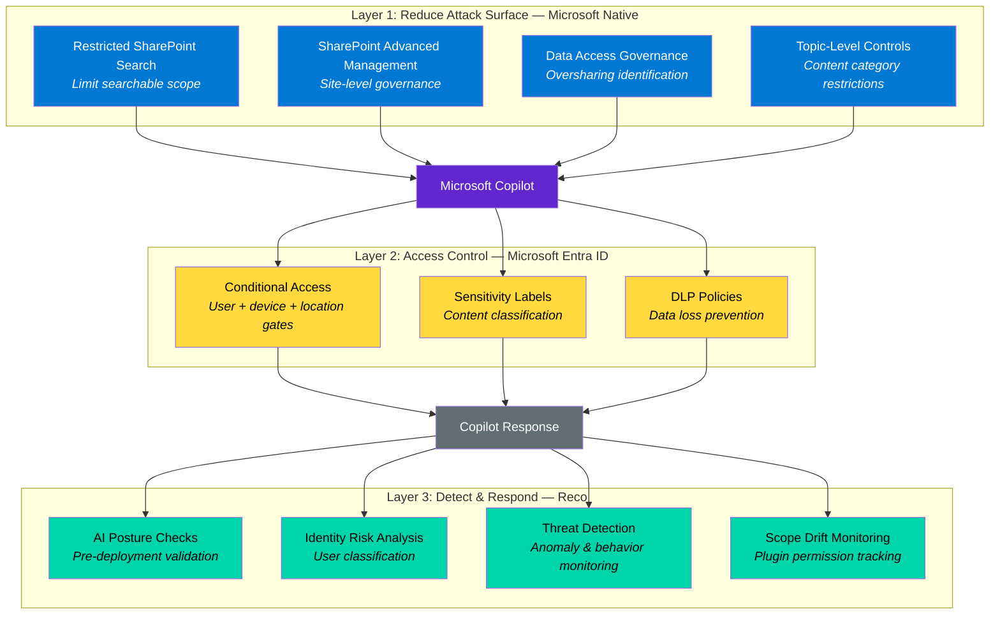

# Complementary: Native Microsoft Purview Copilot Controls

[← Back to Overview](../README.md)

## Overview

Microsoft has been rolling out native Copilot security controls within Purview and SharePoint Advanced Management. These controls are complementary to Reco's AI governance layer — they reduce the attack surface by limiting what Copilot can access, while Reco monitors how that access is used and detects misuse.

## Restricted SharePoint Search

**What it does:** Limits which SharePoint sites Copilot can index and surface content from. Instead of Copilot searching across all sites a user has access to, it restricts queries to a curated allowlist of approved sites.

**When to use it:** During initial Copilot rollout when permission debt hasn't been fully remediated. Acts as a safety net — even if oversharing exists on unlisted sites, Copilot won't surface that content.

**How it complements Reco:**
- Restricted SharePoint Search limits the *searchable scope*
- Reco monitors *what happens within that scope* — detecting anomalous access patterns, bulk queries, and sensitive content surfacing

## SharePoint Advanced Management

**What it does:** Provides site-level access governance including oversharing reports, site lifecycle policies, and data access governance at the site collection level.

**Key capabilities:**
- Oversharing reports identifying broadly shared content
- Site lifecycle policies for inactive sites
- Conditional access policies at the site level
- Data access governance dashboards

**How it complements Reco:**
- SAM identifies oversharing at the SharePoint level
- Reco extends this with cross-service visibility (Teams, Exchange, OneDrive) and adds identity risk correlation

## Data Access Governance Reports

**What it does:** Identifies content shared broadly across the tenant — org-wide shares, external shares, anonymous links — and surfaces it in Microsoft Purview.

**How it complements Reco:**
- DAG reports are Microsoft's native version of the permission audit
- Reco adds the risk classification layer (correlating sharing scope with sensitivity labels) and the continuous monitoring that detects when new oversharing occurs

## Topic-Level Permission Controls

**What it does:** Restricts Copilot from surfacing content in specific topics or sensitivity categories, adding granular control beyond file-level permissions.

**How it complements Reco:**
- Topic controls restrict what Copilot *generates*
- Reco detects when users *attempt* to surface restricted content — providing the detection signal that native controls alone don't offer

## Defense-in-Depth Model

> **The key insight:** Native controls and Reco address different layers of the problem. Native controls restrict what Copilot *can* access. Reco detects what users *are doing* with that access. A defense-in-depth approach uses both.
