# Step 1: Fix Permission Debt First

[← Back to Overview](../README.md) | [Next: Step 2 →](step-2-posture-checks.md)

## Overview

Before enabling Copilot for any user, you need a clear picture of what your current permissions expose. In most environments, legacy sharing and unmanaged access sprawl create risk that is invisible until Copilot makes it searchable.

## How Permission Debt Becomes Copilot Exposure

```mermaid
graph TD
    subgraph "Legacy State — Before Copilot"
        LS1[Marketing shared a folder<br/>with Everyone 2 years ago]
        LS2[HR file has an old<br/>anonymous sharing link]
        LS3[Finance subfolder has<br/>broken permission inheritance]
        LS4[External partner still has<br/>access after project ended]
    end

    subgraph "Risk — Invisible But Present"
        R1[Users CAN access these files<br/>but rarely do — low discovery]
    end

    subgraph "After Copilot — Amplified"
        A1[Any user can ASK Copilot<br/>to find this content]
        A2[Copilot surfaces it instantly<br/>in natural language responses]
        A3[Low-visibility oversharing becomes<br/>high-visibility data exposure]
    end

    LS1 & LS2 & LS3 & LS4 --> R1
    R1 -->|Copilot enabled| A1 --> A2 --> A3

    style R1 fill:#ffd93d,color:#000
    style A1 fill:#ff6b6b,color:#fff
    style A2 fill:#ff6b6b,color:#fff
    style A3 fill:#d63031,color:#fff
```



## Priority Order

Start with the highest risk content first:

1. **Publicly accessible files** — Files shared with "Anyone with the link"
2. **Organization-wide shares** — Content shared across the entire tenant
3. **Externally shared files** — Documents shared with external collaborators
4. **Sensitivity label mismatches** — Files tagged as `Confidential` or `Internal Only` that have broad sharing

## SharePoint Permission Inheritance Warning

> **Warning:** SharePoint permission inheritance is a common source of unintended access. A folder may appear restricted while individual files within it retain broader sharing permissions applied in the past. Copilot generates responses based on a user's effective Microsoft 365 access, including files with legacy or inconsistent sharing settings.

### How Inheritance Breaks

```
📁 Project Folder (Restricted to Team A)
├── 📄 report.docx ← Inherited: Team A only ✅
├── 📄 budget.xlsx ← Overridden: Shared with Everyone ⚠️
└── 📄 strategy.pptx ← Overridden: External sharing enabled ⚠️
```

## Action Items

### 1. Generate a Sensitivity Label Conflict Report

Identify files where sensitivity labels conflict with their sharing scope:

```powershell
# PowerShell: Find files with Confidential label shared broadly
Get-PnPListItem -List "Documents" -PageSize 500 | Where-Object {
    $_["_ComplianceTag"] -eq "Confidential" -and
    $_["SharedWithUsers"] -match "Everyone"
} | Select-Object FileLeafRef, FileRef, SharedWithUsers
```

### 2. Audit Sharing Links

```powershell
# Find all anonymous/organization-wide sharing links
Get-PnPSite -Includes SharingCapability | Where-Object {
    $_.SharingCapability -ne "Disabled"
}
```

### 3. Remediation Priority Matrix

| Risk Level | Condition | Action |
|------------|-----------|--------|
| **Critical** | Confidential + External sharing | Revoke immediately |
| **High** | Confidential + Org-wide sharing | Restrict to named users |
| **Medium** | Internal Only + Broad sharing | Review and scope down |
| **Low** | General + Team sharing | Monitor for drift |

## Remediation Workflow


## Validation

Before proceeding to Step 2, confirm:
- [ ] No `Confidential` files are shared organization-wide
- [ ] No `Confidential` files have external sharing enabled
- [ ] Orphaned sharing links have been revoked
- [ ] SharePoint permission inheritance has been audited for high-value sites

## Next Step

→ [Step 2: Pass the Copilot Posture Checks](step-2-posture-checks.md)
