# Step 2: Pass the Copilot Posture Checks

[← Step 1](step-1-fix-permission-debt.md) | [Back to Overview](../README.md) | [Step 3 →](step-3-block-high-risk-users.md)

## Overview

These six posture checks validate the configurations that most directly shape Copilot exposure. If any check fails, enabling Copilot can expand the impact of existing access gaps, risky identities, or unmanaged device usage by making discoverable content easier to find and summarize.

## Navigation

**Reco Console:** `AI Governance → AI Posture Checks`

## The Six Posture Checks

### 1. Conditional Access Policies

Verify that Conditional Access policies are configured to control who can access Copilot and under what conditions.

**Severity:** HIGH

**What to validate:**
- MFA is required for Copilot access
- Unmanaged devices are blocked or limited
- Location-based restrictions are enforced

### 2. Data Loss Prevention (DLP) Policies

Ensure DLP policies cover Copilot-generated content and prevent sensitive data from being surfaced or exported.

**Severity:** HIGH

**What to validate:**
- DLP policies apply to Copilot interactions
- Sensitive information types are detected in AI-generated responses
- Blocking actions are configured for high-sensitivity content

### 3. Sensitivity Labels

Confirm that sensitivity labels are deployed and enforced across the content that Copilot can access.

**Severity:** HIGH

**What to validate:**
- Labels are applied to all high-value content
- Auto-labeling policies are active
- Label-based access restrictions are enforced

### 4. External Sharing Controls

Validate that external sharing settings prevent Copilot from surfacing content shared with external parties.

**Severity:** MEDIUM

**What to validate:**
- Guest access policies are reviewed
- External sharing is scoped to approved domains
- Anonymous sharing links are disabled or limited

### 5. Device Compliance

Ensure that only compliant devices can access Copilot-enabled services.

**Severity:** MEDIUM

**What to validate:**
- Device compliance policies are enforced
- Non-compliant devices are blocked from Copilot
- Mobile device management (MDM) is configured

### 6. Audit Logging

Verify that audit logging captures Copilot interactions for investigation and compliance.

**Severity:** MEDIUM

**What to validate:**
- Unified Audit Log is enabled
- Copilot-specific events are captured
- Log retention meets compliance requirements

## Compliance Mappings

Each posture check aligns with established frameworks:

| Posture Check | CIS M365 Benchmark v5.0 | ISO 27001:2022 |
|--------------|--------------------------|----------------|
| Conditional Access | 5.2.2, 5.2.3 | A.8.3, A.8.5 |
| DLP Policies | 3.1.1, 3.2.1 | A.8.10, A.8.12 |
| Sensitivity Labels | 3.3.1 | A.5.12, A.5.13 |
| External Sharing | 7.2.3, 7.2.6 | A.5.14, A.8.3 |
| Device Compliance | 5.1.2 | A.8.1 |
| Audit Logging | 8.5.1 | A.8.15 |

## Posture Check Decision Flow

```mermaid
graph TD
    START[Begin Posture Validation] --> H1{Conditional Access<br/>configured?}
    H1 -->|No| FH1[Configure MFA + device + location<br/>in Entra ID]
    H1 -->|Yes| H2{DLP policies cover<br/>Copilot interactions?}
    FH1 --> H1

    H2 -->|No| FH2[Update Purview DLP<br/>to include Copilot location]
    H2 -->|Yes| H3{Sensitivity labels<br/>deployed + auto-labeling?}
    FH2 --> H2

    H3 -->|No| FH3[Deploy labels via Purview<br/>Enable auto-labeling policies]
    H3 -->|Yes| GATE1{All 3 HIGH<br/>checks pass?}
    FH3 --> H3

    GATE1 -->|No| BLOCK[🚫 Do NOT enable Copilot]
    GATE1 -->|Yes| PILOT[✅ Cleared for Pilot]

    PILOT --> M1{External sharing<br/>scoped to approved domains?}
    M1 -->|No| FM1[Restrict in SharePoint<br/>Admin Center]
    M1 -->|Yes| M2{Device compliance<br/>enforced via Intune?}
    FM1 --> M1

    M2 -->|No| FM2[Configure Intune<br/>compliance policies]
    M2 -->|Yes| M3{Audit logging captures<br/>Copilot events?}
    FM2 --> M2

    M3 -->|No| FM3[Enable Unified Audit Log<br/>Set retention policy]
    M3 -->|Yes| GATE2{All 3 MEDIUM<br/>checks pass?}
    FM3 --> M3

    GATE2 -->|No| LIMIT[⚠️ Pilot only — fix MEDIUM checks]
    GATE2 -->|Yes| PROD[✅ Cleared for Production Rollout]

    style BLOCK fill:#d63031,color:#fff
    style PILOT fill:#00b894,color:#fff
    style PROD fill:#00b894,color:#fff
    style LIMIT fill:#fdcb6e,color:#000
    style GATE1 fill:#2d3436,color:#fff
    style GATE2 fill:#2d3436,color:#fff
```

## Gate Rule

> **Action:** Do not expand Copilot access until all HIGH severity checks pass. MEDIUM severity checks should be addressed before proceeding to broad production rollout.

## Next Step

→ [Step 3: Block High-Risk Users](step-3-block-high-risk-users.md)
