# Step 3: Block High-Risk Users

[← Step 2](step-2-posture-checks.md) | [Back to Overview](../README.md) | [Step 4 →](step-4-detect-risky-ai-usage.md)

## Overview

Not every identity in your tenant should have access to Copilot. Users with elevated risk based on role, behavioral signals, or account status can significantly increase exposure when generative AI is enabled. Identify and restrict these users before Copilot expands the reach of their existing access.

## Navigation

**Reco Console:** `Identities → Users`

## High-Risk User Categories

### 1. Departing Employees

Users in offboarding or departure workflows should not retain Copilot access. A departing employee with Copilot could rapidly surface and collect sensitive information before their access is terminated.

### 2. Elevated Risk Identities

Users flagged by Microsoft Entra ID Protection with elevated sign-in or user risk signals. These accounts may be compromised or exhibiting anomalous behavior.

### 3. Over-Privileged Accounts

Service accounts, admin accounts, or users with excessive permissions that were never scoped down. Copilot amplifies whatever access these identities already have.

### 4. External Identities

Guest users and B2B collaboration accounts that may have accumulated broader access than intended over time.

## Conditional Access Policy Configuration

Create a Conditional Access policy in Microsoft Entra ID that blocks Microsoft 365 Copilot for high-risk users:

```json
{
  "displayName": "Block Copilot for High-Risk Users",
  "state": "enabled",
  "conditions": {
    "users": {
      "includeGroups": [
        "high-risk-users-group-id",
        "departing-employees-group-id"
      ]
    },
    "applications": {
      "includeApplications": [
        "Microsoft 365 Copilot"
      ]
    },
    "userRiskLevels": [
      "high"
    ]
  },
  "grantControls": {
    "operator": "OR",
    "builtInControls": [
      "block"
    ]
  }
}
```

## Dynamic Risk Labels

These labels can update based on:
- **Identity risk signals** from Microsoft Entra ID Protection
- **HR-driven lifecycle events** (onboarding, role change, departure)
- **Behavioral analytics** from Reco's identity monitoring

> If a user is flagged as elevated risk or in a departure workflow, they should not retain Copilot access by default.

## Identity Risk Classification

```mermaid
graph TD
    USER[User Identity] --> SIGNALS[Risk Signal Aggregation]

    SIGNALS --> S1[Entra ID Protection<br/>Sign-in risk + User risk]
    SIGNALS --> S2[HR System Integration<br/>Lifecycle status]
    SIGNALS --> S3[Behavioral Analytics<br/>Reco identity monitoring]
    SIGNALS --> S4[Permission Analysis<br/>Over-privileged detection]

    S1 & S2 & S3 & S4 --> EVAL{Risk<br/>Evaluation}

    EVAL -->|Low Risk| GREEN[✅ Standard Access<br/>Normal monitoring]
    EVAL -->|Medium Risk| YELLOW[⚠️ Enhanced Monitoring<br/>Additional logging]
    EVAL -->|High Risk| RED[🚫 Copilot Blocked<br/>CA policy enforced]
    EVAL -->|Departing| BLACK[🚫 Copilot Blocked<br/>Immediate revocation]

    RED --> DG[Dynamic Security Group<br/>Auto-membership update]
    BLACK --> DG

    DG --> CA[Conditional Access Policy<br/>Block Copilot App ID]

    style GREEN fill:#00b894,color:#fff
    style YELLOW fill:#fdcb6e,color:#000
    style RED fill:#d63031,color:#fff
    style BLACK fill:#2d3436,color:#fff
    style DG fill:#e17055,color:#fff
    style CA fill:#0078d4,color:#fff
```



## Action Items

- [ ] Identify all users with elevated risk scores in Entra ID
- [ ] Create a dynamic security group for high-risk users
- [ ] Create the Conditional Access policy blocking Copilot for this group
- [ ] Confirm the control is enforced
- [ ] Validate that Copilot posture checks reflect the requirement as passing
- [ ] Set up automated group membership updates based on risk signals

## Next Step

→ [Step 4: Detect Risky AI Usage](step-4-detect-risky-ai-usage.md)
