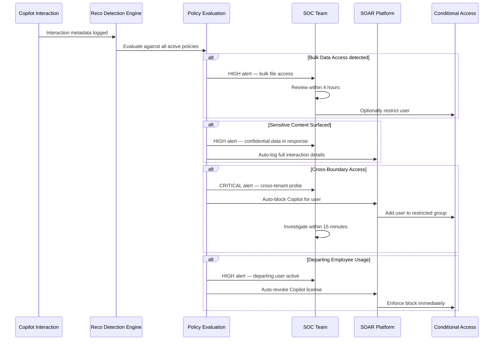

# Step 4: Detect Risky AI Usage Across the Environment

[← Step 3](step-3-block-high-risk-users.md) | [Back to Overview](../README.md) | [Step 5 →](step-5-monitor-scope-drift.md)

## Overview

Once Copilot is live, you need continuous visibility into how AI tools are being used across your environment. Indicators such as bulk data access, anomalous usage patterns, or attempts to surface sensitive information should be monitored closely and surfaced through detection policies as quickly as possible.

## Navigation

**Reco Console:** `Threat Detection → Policy Center`

## Deployment Strategy

### Phase 1: Preview Mode (Pilot)

Start with policies in **Preview** mode during your pilot:
- Generates alerts for review
- Does not trigger production notification routing
- Allows you to understand normal usage patterns
- Builds a baseline of expected Copilot behavior

### Phase 2: Production Mode

Once you understand normal patterns, switch to **On** for production:
- Full alert routing to SOC/SIEM
- Automated response workflows
- Escalation procedures active

## Detection Policies to Configure

### 1. Bulk Data Access via Copilot

Detect when a user leverages Copilot to access an unusually high volume of files or data in a short period.

```yaml
policy:
  name: "Copilot Bulk Data Access"
  severity: high
  trigger:
    event: copilot_file_access
    threshold: 50
    window: 1h
  conditions:
    - file_count > baseline_average * 3
    - unique_sites > 5
  action:
    - alert
    - restrict_copilot_temporarily
```

### 2. Sensitive Content Surfacing

Flag when Copilot responses include content from files with high-sensitivity labels.

```yaml
policy:
  name: "Copilot Sensitive Content Alert"
  severity: high
  trigger:
    event: copilot_response_generated
  conditions:
    - source_file_label in ["Confidential", "Highly Confidential"]
    - user_clearance_level < file_sensitivity_level
  action:
    - alert
    - log_interaction
```

### 3. Anomalous Usage Patterns

Detect deviations from a user's normal Copilot interaction patterns.

```yaml
policy:
  name: "Copilot Anomalous Usage"
  severity: medium
  trigger:
    event: copilot_interaction
  conditions:
    - daily_query_count > baseline_p95
    - off_hours_usage == true
    - new_topic_categories > 3
  action:
    - alert
    - flag_for_review
```

### 4. Cross-Tenant Data Discovery

Monitor attempts to use Copilot to discover data across tenant boundaries or in shared environments.

```yaml
policy:
  name: "Copilot Cross-Boundary Access"
  severity: critical
  trigger:
    event: copilot_query
  conditions:
    - target_scope == "cross_tenant"
    - guest_user == true
  action:
    - block
    - alert
    - incident_create
```

## Alert Triage Workflow

```
Alert Triggered
     │
     ▼
┌─────────────┐     ┌──────────────┐
│  Severity?  │────▶│   Critical   │──▶ Immediate SOC review
└─────────────┘     └──────────────┘
     │
     ▼
┌──────────────┐
│     High     │──▶ Review within 4 hours
└──────────────┘
     │
     ▼
┌──────────────┐
│    Medium    │──▶ Review within 24 hours
└──────────────┘
     │
     ▼
┌──────────────┐
│     Low      │──▶ Weekly review batch
└──────────────┘
```

## Alert Response Automation



## Next Step

→ [Step 5: Monitor Permission Scope Drift](step-5-monitor-scope-drift.md)
