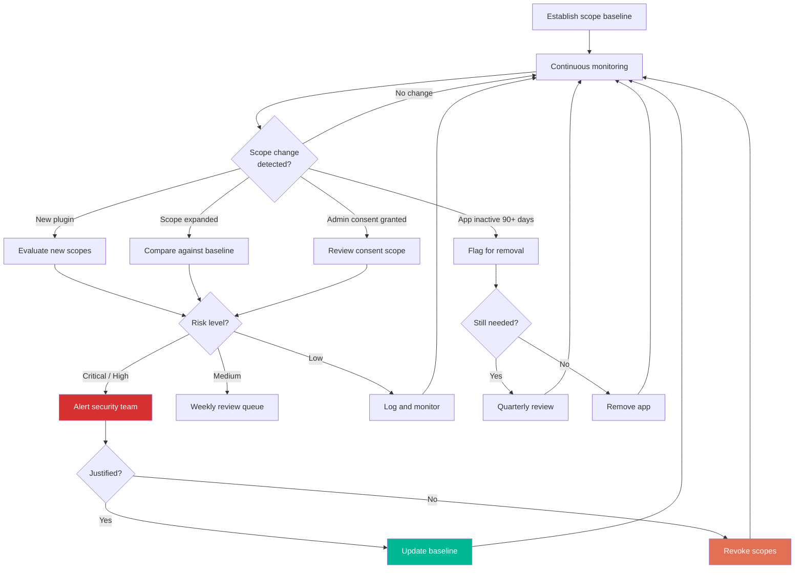

# Step 5: Monitor Permission Scope Drift

[← Step 4](step-4-detect-risky-ai-usage.md) | [Back to Overview](../README.md)

## Overview

Copilot's effective access expands silently as plugins are added and permission scopes change. What starts as `Files.Read` + `User.Read` can drift to `Mail.ReadWrite` + `Sites.ReadWrite.All` within months.

## What Causes Scope Drift

1. **New plugin installations** — each plugin may request additional OAuth scopes
2. **Integration updates** — vendors may expand requested permissions
3. **Admin consent grants** — broad admin consent silently expands access
4. **Delegated permissions accumulation** — users granting incremental access over time

## What to Monitor

| Attribute | What to Check |
|-----------|--------------|
| App Name | Is this an approved application? |
| Publisher | Verified and trusted? |
| Scopes Requested | Match the app's stated function? |
| Consent Type | Admin consent vs. user consent |
| Last Used | Inactive 90+ days → review for removal |
| Users Count | How many users have consented? |

## Scope Risk Tiers

See [`scripts/scope_drift_monitor.py`](../scripts/scope_drift_monitor.py) for the full `SCOPE_RISK_MAP` and baseline comparison logic.

| Risk | Example Scopes | Action |
|------|---------------|--------|
| **Critical** | `Directory.ReadWrite.All`, `Mail.ReadWrite`, `Mail.Send` | Immediate review |
| **High** | `Files.ReadWrite.All`, `Sites.ReadWrite.All`, `Chat.ReadWrite.All` | Review within 1 week |
| **Medium** | `User.Read.All`, `Group.Read.All`, `Directory.Read.All` | Quarterly review |
| **Low** | `User.Read`, `profile`, `openid` | Annual review |

## Remediation

**Excessive scopes:** Review individual plugin permissions → revoke unnecessary scopes → verify app functionality with reduced permissions.

**Unused apps (90+ days inactive):** Confirm with app owners → revoke all permissions → remove app registration if appropriate.

## Scope Drift Detection Flow

